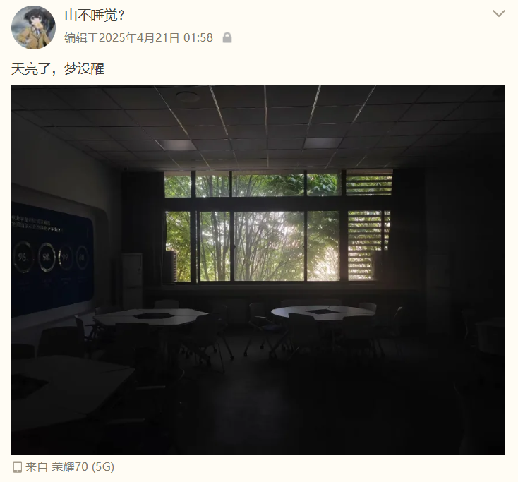

# ChapterX_Project_detailed_plan

基于动态RAG和大模型的算术与数学问题解答系统——“第十章”项目详细方案与源文件。

## 小记

本项目是2025年第16届大学生服务外包创新创业大赛 A15赛题 参赛作品，遗憾未能斩获奖项。

本项目 **仅供参考** 。

## 关键词

检索增强生成（RAG）；查询重写（Query Rewriting）；Prompt工程（Prompt Engineering）。

## 团队

|  <b>ChangAkira</b> |  <b>cheng-QAQ</b> |  <b>九雷应普天尊</b> |  <b>ioocoder</b> |  <b>wuyong-exe</b> |
| :---------------------------------------------------------------------------------------------: | :-------------------------------------------------------------------------------------------: | :-----------------------------------------------------------------------------------------------: | :-----------------------------------------------------------------------------------------: | :---------------------------------------------------------------------------------------------: |
|        [博客](https://changakira.github.io)  [GitHub](https://github.com/changakira)        |                            [GitHub](https://github.com/cheng-QAQ)                             |                              [GitHub](https://github.com/dwad114514)                              |                            [GitHub](https://github.com/ioocoder)                            |                             [GitHub](https://github.com/wuyong-exe)                             |

“十方算阁”团队由5名西安电子科技大学在校生组成，进行该项目时（2025.1-2025.4）一名大三，四名大二。

项目名称“第十章”（Chapter X）灵感来自《九章算术》。团队名称“十方算阁”由此衍生。

## 项目简介

本项目是一个基于 Flask 开发的智能代数问答后端。系统整合了 OCR 图像识别，采用两阶段 RAG 处理流水线：先由大模型提取意图，在本地 FAISS 向量库中检索对应公式与概念，再由主模型结合历史对话进行推理，最终向前端流式输出详细解答与拓展推荐。

大模型方面，主要就是ollama部署本地模型、调用API。 **项目重点是后端双链路架构的设计。**

我们搜集到一些代数知识，使用RAG技术构建专业的代数知识问答平台。由于是参加服务外包创新创业大赛，在项目中还包含了市场调研等，以期给公司提供初步的可行方案。

项目包括flask后端和网页端（网页端的一部分借用了html5up-photon的的静态网页设计：[https://html5up.net/photon](https://html5up.net/photon)）。

## 系统架构图

.svg>)

## 指南

`T2403770_十方算阁_A15 基于 RAG 和大模型的算术与数学问题解答【万维艾斯】` 文件夹：T2403770是队号，“十方算阁”是团队名称，A15是A组第15题，“基于 RAG 和大模型的算术与数学问题解答”是题目名称，“万维艾斯”是出题方。

文件夹结构如下。

    ├─分类知识库文件存档（excle表）
    ├─演示与测试视频
    └─附件
        │  0_附件目录.md
        │  1_参考文献目录.docx
        │  2_大模型选型说明.xlsx
        │  3_Prompt展示.txt
        │  4_项目部署与测试说明.md
        │  5_提取关键字程序.py
        │  6_开源说明.md
        ├─一、数据来源文件（部分）
        ├─三、图表集
        ├─二、前端界面展示
        └─四、项目源文件
            ├─html5up-photon_VER1
            ├─MathJax-master
            ├─models
            ├─START
            └─thetwo

`演示与测试视频` 文件较大，未上传GitHub。可通过在线链接查看。

## Q & A 

为了方便读者更快地对项目有了解，此处设立Q & A 环节。

1. Q: 知识库形式？来源？清洗方式？
   
   A: 知识库全部为csv文件，这是比赛时出题者要求的。来源于中学教材、相关读物、高中试卷。人工与AI清洗，公式使用latex表示。

2. Q: 

## 轶事

  
   
  <i>天亮了，梦没醒</i>

